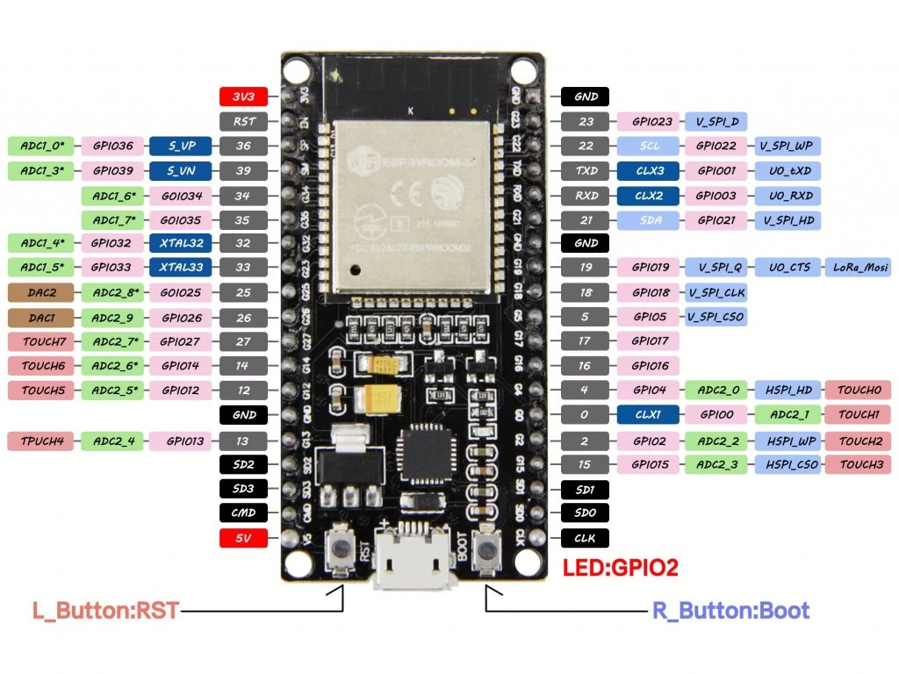

# Firmware for a smart self-watering flower pot

This repository contains a code I made in Arduino IDE for ESP32 for my smart self-watering flower pot project. Designed from scratch, printed, assembled, all by me. 

### Functions:

- Controlling watering of the flower pot in 3 modes
  - periodical (set to specific day hours)
  - threshold (based on the soil moisture)
  - manual
- Battery powered
- Automatic sleep mode for energy saving
- OLED display with info screens
- Menu with settings for all the features

## Schemes

## Technology used

Whole flower pot body was designed in Fusion 360 and printed on Bambulab A1, using black generic PETG. 

Water tank was sprayed with clear coat to seal all potentional leaks.

Firmware was developed in Arduino IDE. Flower pot uses an ESP32-DevKitC 38pin. 

## Final product v2

 

 

